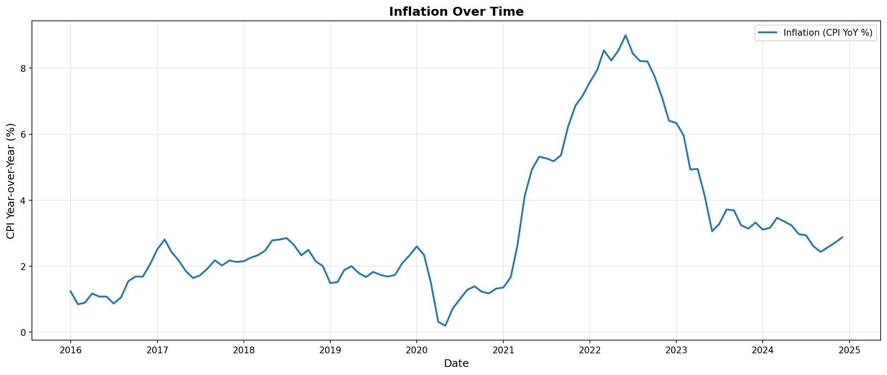

# The Impact of Inflation on U.S. Consumer Spending (2015–2024)

## Contributors
- **Bingqing Li** 
- **Haoyu Shi**

## Summary

This project investigates how inflation has influenced consumer spending behavior in the United States between 2015 and 2024, a period marked by significant economic volatility. The COVID-19 pandemic, supply chain disruptions, and shifts in fiscal and monetary policy created unprecedented inflationary pressures, particularly from 2020 onward. Understanding the relationship between inflation and consumer spending is crucial for policymakers and businesses seeking to navigate economic uncertainty and support household financial stability.

Our central research questions were: (1) How has rising inflation since 2020 affected real consumer spending in the United States? (2) What is the statistical relationship between inflation (measured by the Consumer Price Index) and total personal consumption expenditures? (3) Does the effect of inflation on spending appear immediately, or does it occur with a time lag?

To answer these questions, we collected monthly time series data from the Federal Reserve Economic Data (FRED) database covering January 2015 through December 2024. We integrated two key datasets: the Consumer Price Index for All Urban Consumers (CPIAUCSL) from the U.S. Bureau of Labor Statistics and Personal Consumption Expenditures (PCE) from the U.S. Bureau of Economic Analysis. Our methodology followed a complete data lifecycle approach, including systematic data acquisition, quality assessment, integration, enrichment with analytical variables, and statistical modeling.

We created several derived variables to facilitate analysis, including inflation-adjusted real PCE (in constant 2015 dollars), a CPI index normalized to January 2015, and year-over-year growth rates for all key variables. This enrichment enabled us to analyze both nominal and real trends in consumer spending while accounting for inflationary effects.

Our analysis revealed a statistically significant positive relationship between inflation rates and real consumer spending, contrary to the expected inverse relationship. The baseline regression model showed that a one percentage point increase in year-over-year CPI growth is associated with an increase of approximately $224.66 in real PCE (p < 0.001, R² = 0.343). However, this counterintuitive finding requires careful interpretation. The positive coefficient likely reflects complex economic dynamics during the study period, including significant fiscal stimulus measures (particularly in 2020-2021), supply-side inflation driven by shortages rather than demand, and possible temporal misalignment between inflation measurement and consumer response.

We also tested a lagged model incorporating inflation rates from one and two months prior to determine whether inflation effects manifest with a delay. The lagged model did not significantly improve explanatory power (AIC: 1691.07 vs. 1687.92 for baseline), and the lagged inflation coefficients were not statistically significant. This suggests that if inflation does impact consumer spending, the effect is either immediate or occurs over longer time horizons than captured by our monthly lags.

The findings highlight the complexity of macroeconomic relationships and the importance of considering broader economic context when interpreting statistical associations. While our model explains approximately 34% of the variation in real consumer spending, other factors such as income growth, employment levels, consumer confidence, savings rates, and government policy interventions likely play substantial roles.

## Data Profile

### Dataset 1: Consumer Price Index for All Urban Consumers (CPIAUCSL)

**Source:** U.S. Bureau of Labor Statistics via Federal Reserve Economic Data (FRED)  
**Access Method:** FRED API with authentication  
**Series ID:** CPIAUCSL  
**Temporal Coverage:** January 2015 – December 2024 (120 monthly observations)  
**Update Frequency:** Monthly

The Consumer Price Index for All Urban Consumers (CPI-U) measures the average change over time in prices paid by urban consumers for a market basket of consumer goods and services. It represents approximately 93% of the U.S. population and is the most widely used measure of inflation. The BLS calculates the CPI using a fixed basket approach, tracking prices for categories including food, energy, housing, transportation, medical care, education, and recreation.

**Ethical and Legal Considerations:** The CPI data is publicly available and explicitly designated for unrestricted use under U.S. government open data policies. As a statistical aggregate derived from price surveys, it contains no personally identifiable information and raises no privacy concerns. The data is produced by a federal statistical agency following rigorous methodological standards, ensuring reliability and transparency. Educational and research use is explicitly permitted without licensing requirements.

**Limitations:** The CPI measures price changes for a fixed basket of goods, which may not perfectly reflect individual consumption patterns. Geographic and demographic variations in inflation are not captured in the national-level index used in this study. Additionally, the CPI has known methodological limitations, including substitution bias and challenges in measuring quality improvements.

### Dataset 2: Personal Consumption Expenditures (PCE)

**Source:** U.S. Bureau of Economic Analysis via Federal Reserve Economic Data (FRED)  
**Access Method:** Direct CSV download from FRED website  
**Series ID:** PCE  
**Temporal Coverage:** January 2015 – December 2024 (120 monthly observations)  
**Update Frequency:** Monthly  
**Units:** Billions of dollars, seasonally adjusted annual rate

Personal Consumption Expenditures represents the primary measure of consumer spending on goods and services in the U.S. economy. The BEA compiles PCE data from various sources including retail sales, service industry surveys, and administrative records. PCE is a key component of Gross Domestic Product (GDP) calculations and serves as the Federal Reserve's preferred inflation measure when using the PCE price index variant.

**Ethical and Legal Considerations:** PCE data is publicly available under the same open data policies as CPI. The data represents aggregated economic activity at the national level with no individual-level information. The BEA follows strict confidentiality protocols in its source data collection, ensuring that published aggregates cannot be reverse-engineered to identify individual businesses or consumers. Educational use is permitted without restriction.

**Limitations:** PCE data is seasonally adjusted, which may mask some real variations in spending patterns. The data represents national aggregates and does not capture distributional effects—inflation may impact different income groups differently, but this is not visible in aggregate PCE. Additionally, PCE data undergoes periodic revisions as more complete source data becomes available, though our analysis used the data as published at the time of retrieval.

### Data Integration and Derived Variables

We integrated both datasets into a unified time series aligned by date, creating a single file (`macro_monthly.csv`) with 120 monthly observations. To support our analysis, we created five analytical variables:

1. **cpi_index_2015_01_100:** CPI normalized with January 2015 = 100
2. **real_pce:** Inflation-adjusted PCE in constant 2015 dollars
3. **pce_yoy_pct:** Year-over-year percentage change in nominal PCE
4. **real_pce_yoy_pct:** Year-over-year percentage change in real PCE
5. **cpi_yoy_pct:** Year-over-year percentage change in CPI (inflation rate)

All derived variables are documented with detailed calculation methods in accompanying metadata files. The integration process maintained complete temporal coverage with no gaps or duplicate dates.

## Data Quality

We conducted comprehensive quality assessment on both raw and integrated datasets to ensure reliability before proceeding with analysis. The assessment examined multiple dimensions of data quality including completeness, consistency, validity, and temporal integrity.

### Quality Assessment Methodology

Our quality assessment process included:
- **Completeness checks:** Identification of missing values across all variables
- **Duplicate detection:** Verification of unique date identifiers
- **Temporal continuity:** Confirmation of uninterrupted monthly sequences
- **Range validation:** Verification that all values fall within economically reasonable bounds
- **Integration validation:** Confirmation of proper one-to-one date alignment between datasets

### Key Findings

**Completeness:** The core variables (date, CPI, and PCE) exhibited perfect completeness with zero missing values across all 120 monthly observations. Year-over-year growth rate variables (pce_yoy_pct, real_pce_yoy_pct, cpi_yoy_pct) contained 12 missing values in the first year (January–December 2015), which is expected and unavoidable since these variables require 12-month lookback periods for calculation. Once the initial year established baseline values, no further missing data was observed.

**Uniqueness:** No duplicate dates were detected in either the raw datasets or the integrated file. Each monthly observation from January 2015 through December 2024 appeared exactly once, confirming proper data structure.

**Temporal Integrity:** The dataset demonstrated complete monthly coverage with no gaps in the time series. All 120 expected months were present in chronological order with consistent date formatting (YYYY-MM-DD).

**Value Range Validation:** All CPI values fell within the expected range for the study period (approximately 230–320), reflecting the gradual price increases from 2015 to 2024. PCE values ranged from approximately $12 trillion to $20 trillion (seasonally adjusted annual rate), consistent with U.S. economic growth patterns. Growth rate variables showed reasonable ranges, with inflation (cpi_yoy_pct) ranging from 0.2% to 9.0%, capturing both the low-inflation environment of 2015–2019 and the elevated inflation of 2021–2022.

**Integration Quality:** The merge operation between CPI and PCE datasets was validated to ensure proper alignment. All 120 dates matched exactly between the two source datasets, resulting in a complete inner join with no data loss. The integration preserved data integrity and maintained temporal alignment.

### Statistical Profile

Descriptive statistics for year-over-year growth rates (108 observations with complete data):
- **CPI inflation rate:** Mean = 3.19%, SD = 2.20%, Range = 0.20% to 9.00%
- **Nominal PCE growth:** Mean = 5.61%, SD = 5.03%, Range = -14.28% to 29.95%
- **Real PCE growth:** Mean = 2.32%, SD = 3.78%, Range = -14.55% to 24.78%

The wide ranges and high standard deviations, particularly for PCE variables, reflect the extraordinary economic volatility during the COVID-19 pandemic (2020) and subsequent recovery period (2021–2022).

### Data Quality Conclusion

The integrated dataset meets high quality standards and is suitable for statistical analysis. The only data quality issue—missing values in the first 12 observations of year-over-year variables—is a necessary artifact of the calculation method rather than a data quality problem. All subsequent analyses were conducted on the 108 observations with complete data (2016–2024), which provides sufficient statistical power for regression modeling while maintaining data integrity.

## Findings

Our statistical analysis reveals a complex and counterintuitive relationship between inflation and consumer spending during the 2015–2024 period.

### Exploratory Data Analysis

Before conducting regression analysis, we examined the temporal patterns and relationships in our data through visualization.

**Figure 1: Inflation Over Time**

The inflation time series reveals distinct phases in the study period. From 2015 through early 2020, inflation remained relatively stable, oscillating between 0.2% and 3.0% year-over-year, consistent with the Federal Reserve's target range. A dramatic decline occurred in mid-2020 during the initial COVID-19 lockdowns, with inflation briefly dropping near 0.3%. This was followed by an unprecedented surge beginning in early 2021, with inflation peaking at 9.0% in mid-2022—the highest level in recent years. Since then, inflation has gradually declined but remains elevated at around 2.5-3.5% through 2024.

**Figure 2: Trends in PCE (2015-2024)**

The Personal Consumption Expenditures chart illustrates the divergence between nominal and real spending over time. Nominal PCE (blue line) shows consistent upward growth from approximately $12 trillion in 2015 to over $20 trillion in 2024, with a sharp drop in Mid 2020 due to pandemic lockdowns followed by rapid recovery. Real PCE (orange line), adjusted for inflation, grew more modestly from about $12 trillion to $15 trillion over the same period. The gap between the two lines widened substantially after 2021, reflecting the inflation surge. Notably, real PCE experienced its sharpest decline in Mid 2020 but rebounded quickly, and has grown relatively steadily since 2021 despite high inflation.

**Figure 3: Year-over-Year Growth Rates (2015-2024)**

This comparative visualization reveals the dramatic volatility of 2020-2021. All three growth rates showed relative stability from 2016-2019, with inflation (blue) around 1-3%, nominal PCE growth (orange) around 4-5%, and real PCE growth (green) around 2-3%. The pandemic caused an extraordinary collapse in Mid 2020, with real PCE growth plummeting to -14.5%. The recovery in 2021 was equally dramatic, with both nominal and real PCE growth spiking to approximately 25-30% year-over-year—the highest growth rates in the dataset. Since 2022, growth rates have normalized but remain more volatile than the pre-pandemic period, with nominal PCE growth elevated around 6-8% and real PCE growth around 2-4%.

**Figure 4: Correlation Matrix**

The correlation analysis reveals important relationships between variables. CPI inflation shows a strong positive correlation (r = 0.67) with nominal PCE growth, indicating that periods of high inflation tend to coincide with high nominal spending growth. However, the correlation between CPI inflation and real PCE growth is much weaker (r = 0.29), suggesting that inflation-adjusted spending is less strongly associated with inflation rates. The very high correlation (r = 0.90) between nominal and real PCE growth rates indicates that much of the variation in spending growth is shared between nominal and real measures, though they diverge during high-inflation periods. This correlation pattern provides initial evidence that the inflation-spending relationship is more complex than simple economic theory would predict.

### Baseline Regression Model

We estimated a baseline ordinary least squares (OLS) regression model with real Personal Consumption Expenditures as the dependent variable and year-over-year CPI inflation rate as the independent variable:

**Model:** real_pce = β₀ + β₁(cpi_yoy_pct) + ε

**Results:**
- **Constant (β₀):** $12,840 billion (p < 0.001)
- **CPI coefficient (β₁):** $224.66 (p < 0.001)
- **R-squared:** 0.343
- **Adjusted R-squared:** 0.337
- **AIC:** 1687.92
- **BIC:** 1693.25

The model indicates that a one percentage point increase in the inflation rate is associated with an increase of approximately $224.66 billion in real consumer spending. This positive relationship is statistically significant at the 0.001 level and explains approximately 34% of the variation in real PCE.

This positive coefficient contradicts traditional economic theory, which predicts that inflation erodes purchasing power and should reduce real consumption. Several factors may explain this unexpected finding:

1. **Supply-side inflation:** Much of the 2020–2022 inflation resulted from supply chain disruptions and shortages rather than demand-pull inflation, creating unusual dynamics
2. **Fiscal stimulus effects:** Massive government transfers (stimulus checks, enhanced unemployment benefits, PPP loans) in 2020–2021 simultaneously increased both spending and inflation
3. **Temporal dynamics:** Consumers may increase spending in anticipation of future price increases, creating a positive short-term correlation
4. **Measurement timing:** CPI and PCE may not be perfectly synchronized in their measurement periods

### Lagged Model Analysis

To test whether inflation effects manifest with a delay, we estimated an extended model incorporating lagged inflation rates:

**Model:** real_pce = β₀ + β₁(cpi_yoy_pct) + β₂(cpi_yoy_pct_lag1) + β₃(cpi_yoy_pct_lag2) + ε

**Results:**
- **Current inflation (β₁):** $260.26 (p = 0.190, not significant)
- **One-month lag (β₂):** -$197.29 (p = 0.560, not significant)
- **Two-month lag (β₃):** $166.39 (p = 0.396, not significant)
- **R-squared:** 0.348
- **Adjusted R-squared:** 0.329
- **AIC:** 1691.07
- **BIC:** 1701.73

The lagged model showed no significant improvement over the baseline model. The Akaike Information Criterion (AIC) was higher for the lagged model (1691.07 vs. 1687.92), indicating inferior fit when penalizing for additional parameters. Neither lagged inflation coefficient reached statistical significance, suggesting that one- to two-month lags do not capture meaningful inflation effects on consumer spending.

### Model Diagnostics

Both models exhibited some diagnostic concerns:
- **Durbin-Watson statistics** (0.080 and 0.093) indicate substantial positive autocorrelation in residuals, suggesting time-series dependencies not captured by the models
- **Jarque-Bera tests** (p = 0.002 and p = 0.005) reject normality of residuals, indicating skewed distributions
- **Positive skewness** (0.825 and 0.771) in residuals suggests the models under-predict during some high-spending periods

These diagnostic issues suggest that simple linear regression may not fully capture the complex dynamics of the inflation-spending relationship, and that time-series methods (e.g., ARIMA, vector autoregression) might be more appropriate.

### Key Insight

While we find a statistically significant relationship between inflation and consumer spending, the positive sign and model diagnostics indicate that this relationship is more complex than captured by simple correlation. The extraordinary economic conditions of 2020–2024—including pandemic lockdowns, supply shocks, massive fiscal stimulus, and rapid recovery—likely confound traditional inflation-spending dynamics. Our findings highlight the importance of considering broader macroeconomic context when interpreting statistical relationships during periods of economic disruption.

## Future Work

### Methodological Improvements

**Time Series Methods:** Future work should employ more sophisticated time-series econometric techniques better suited to this type of data. Vector Autoregression (VAR) models could capture bidirectional relationships between inflation and spending while accounting for temporal dependencies. ARIMA models with appropriate differencing and lag structures could address the autocorrelation observed in our residuals. Granger causality tests could help determine the direction of causation between inflation and consumer spending.

**Extended Lag Structures:** Our analysis tested only one- and two-month lags, but inflation effects may manifest over longer horizons. Future work should explore lag structures of 3–12 months to capture delayed consumer responses to sustained inflation. Distributed lag models could identify whether effects accumulate over time or dissipate quickly.

**Structural Break Analysis:** The 2020 pandemic represents a clear structural break in economic relationships. Future work should employ some structural break detection methods to formally test whether the inflation-spending relationship changed during the pandemic period. Separate models for pre-pandemic (2015–2019) and pandemic/post-pandemic (2020–2024) periods could reveal whether traditional economic relationships reasserted themselves after initial disruptions.

### Data Enhancement

**Demographic Disaggregation:** Aggregate national data masks important distributional effects. Inflation impacts low-income households more severely than high-income households, both because lower-income consumers spend larger shares of income on necessities (food, energy) that experienced high inflation, and because they have less financial cushion to maintain consumption. Future work should incorporate income-stratified spending data from the Consumer Expenditure Survey to examine differential impacts across income groups.

**Regional Variation:** Housing costs, a major inflation component, vary dramatically across U.S. regions. Incorporating state or metropolitan-area level data could reveal geographic heterogeneity in how inflation affects spending. Regional employment conditions and local policy responses also vary, suggesting that regional analysis could provide valuable insights.

**Additional Economic Controls:** Our models controlled only for inflation, but consumer spending depends on numerous factors. Future work should incorporate:
- Personal income and wage growth
- Unemployment rates
- Consumer confidence indices
- Interest rates and credit conditions
- Stock market and household wealth effects
- Government transfer payments and policy interventions

These controls would better isolate the specific effect of inflation on spending from correlated factors.

### Expanded Scope

**Category-Level Analysis:** Aggregated PCE data obscures category-specific responses to inflation. Consumers may reduce spending on discretionary items (dining out, entertainment) while maintaining or increasing spending on necessities (food, energy, healthcare). Disaggregating PCE into durable goods, nondurable goods, and services would reveal these substitution patterns and provide more actionable insights for businesses and policymakers.

**International Comparison:** Comparing U.S. patterns with other developed economies that experienced different inflation trajectories and policy responses could help disentangle U.S.-specific factors from generalizable relationships. Countries with different social safety nets, wage indexation policies, or central bank responses provide natural experiments for comparative analysis.

### Lessons Learned
The lessons learned in this work were as much about the process as macroeconomics. Technically, we have discovered that the process of dealing with real-life data, particularly that of APIs, such as FRED, demands defensive thinking. We were to process connection problems, uneven and disjointed date ranges between the CPI and PCE and values missing. That was what motivated us to ensure systematic validation of merges, duplicate timestamps, and properly document all of our transformations (e.g., how we calculated real PCE and growth rates). One of the key lessons was that the data downloaded successfully does not imply that it can be analyzed; sanity checks and exploratory plots are a step that should be taken in between.

Constructing the Snakemake pipeline also altered our thinking of data science workflow. We represented the project as a graph of dependencies, where files were the inputs and outputs, rather than executing the scripts manually in a frail order. It became simpler to reproducibly reproduce results, re-run exclusively those stages which had changed and maintain intermediary artifacts (such as cleaned datasets, quality reports and EDA figures) in order. There was also the reproducibility of our specification of the computing environment pinning package version and keeping configuration in a single location. Concisely, the project helped to affirm that a good analysis is not merely an ingenious model; it is a system replicable and auditable by another person.

On the modeling part, we were taught to be mindful of time-series model readings. The early version of our models indicated positive correlation between inflation and real PCE, but diagnostics (AIC/BIC, residual plots, Durbin-Watson) put us back to the fact that shared long-run directions and autocorrelation can generate misleading correlation. We learned to have a more positive attitude to the constraints of basic OLS in working with macroeconomic time series and to the necessity of setting statistical options with the economics.

In the future, the future of work can be pulled in a number of directions. Methodologically, we would be able to get beyond the fixed regressions and explore time-series models like ARIMA, VAR or error-correction models that explicitly model the autocorrelation and possible non-stationarity. It would be possible to test more also rich hypothesis about consumer spending by incorporation of other variables, unemployment, interest rates, consumer confidence, or income measures. This would also be beneficial to categorize PCE into groups (e.g., services vs. durable goods) in order to understand whether inflation influences different forms of expenditure in the same way.

Workflow Workflow-wise, we might add some automated tests (such as verifying date ranges are valid and summary statistics are within expected limits) and continuous integration to run Snakemake on each commit, as well as improving parameterization such that new countries/time periods/indicators can be run by merely changing a single config file. Lastly, we might transform the outputs into an interactive dashboard to give users greater opportunity to examine CPI, PCE, and modeled relationships over time, making the project more usable by non-technical users and providing the opportunity of extending the project to classroom or policy-directed applications.

## Reproducing

The structure of our workflow is, such that, one can re-do the analysis based on the original FRED data, given a few commands. Python 3.9 or later, Git, and a FRED API key, stored as fredapikey.txt in the project root will be required. Moreover, Snakemake will automatically run all the pipeline steps downloading of CPI and PCE, integrating and cleaning of the data, running quality checks, creating EDA outputs, and creating regression models. All the main artifacts will be written to the data/processed/ and results/ folders, and logs of each step will be detailed in folders logs/.

To ensure that the run was successful, you can ensure that you have files like macromonthly.csv, qualityreport.json, and the regression summaries in results/ have been generated. In case of a failure, refer to the relevant log file and make sure that you have the API key and Python environment properly set. To preview the steps that would be run, you can also run snakemake -n or to run a specific output you can specific the path of the output file and pass it to Snakemake. 

### Box link where results of the analysis are stored, including output files, visualizations
**Box Link**: (https://uofi.box.com/s/m70hmdbgk16zm57cu3n3aq0b77awsq00)

Place downloaded files maintaining this structure:
#### Raw data files
- IS477_project/data/raw/CPIAUCSL.csv
- IS477_project/data/raw/CPIAUCSL_metadata.json
- IS477_project/data/raw/PCE.csv
- IS477_project/data/raw/PCE_metadata.json

#### Processed data files
- IS477_project/data/processed/macro_monthly.csv
- IS477_project/data/processed/macro_monthly_metadata.json
- IS477_project/data/processed/quality_report.json

#### Result figures
- IS477_project/results/figures/correlation_matrix.png
- IS477_project/results/figures/growth_rates.png
- IS477_project/results/figures/inflation_over_time.png
- IS477_project/results/figures/pce_trends.png

#### Other result files
- IS477_project/results/baseline_model_summary.txt
- IS477_project/results/lagged_model_summary.txt
- IS477_project/results/correlation_matrix.csv
- IS477_project/results/descriptive_stats.csv
- IS477_project/results/model_results.json
- IS477_project/results/eda_summary.json

## References
U.S. Bureau of Labor Statistics, Consumer Price Index for All Urban Consumers: All Items in U.S. City Average [CPIAUCSL], retrieved from FRED, Federal Reserve Bank of St. Louis; https://fred.stlouisfed.org/series/CPIAUCSL, December 5, 2025.

U.S. Bureau of Economic Analysis, Personal Consumption Expenditures [PCE], retrieved from FRED, Federal Reserve Bank of St. Louis; https://fred.stlouisfed.org/series/PCE, December 5, 2025.

### Software Used

| Software | Version | License | Citation |
|----------|---------|---------|----------|
| Python | 3.9+ | PSF License | Van Rossum, G., & Drake, F. L. (2009). *Python 3 Reference Manual*. CreateSpace. |
| pandas | ≥2.0.0 | BSD 3-Clause | McKinney, W. (2010). Data Structures for Statistical Computing in Python. *Proceedings of the 9th Python in Science Conference*, 51-56. |
| NumPy | ≥1.24.0 | BSD 3-Clause | Harris, C.R., et al. (2020). Array programming with NumPy. *Nature*, 585, 357-362. |
| Matplotlib | ≥3.7.0 | PSF License | Hunter, J. D. (2007). Matplotlib: A 2D Graphics Environment. *Computing in Science & Engineering*, 9(3), 90-95. |
| Seaborn | ≥0.12.0 | BSD 3-Clause | Waskom, M. L. (2021). seaborn: statistical data visualization. *Journal of Open Source Software*, 6(60), 3021. |
| statsmodels | ≥0.14.0 | BSD 3-Clause | Seabold, S., & Perktold, J. (2010). Statsmodels: Econometric and Statistical Modeling with Python. *Proceedings of the 9th Python in Science Conference*, 57-61. |
| Snakemake | ≥7.0.0 | MIT License | Mölder, F., et al. (2021). Sustainable data analysis with Snakemake. *F1000Research*, 10, 33. |
| requests | ≥2.28.0 | Apache 2.0 | Reitz, K. (2011). Requests: HTTP for Humans. https://docs.python-requests.org |
| PyYAML | ≥6.0 | MIT License | Simonov, K. (2006). PyYAML. https://pyyaml.org |
